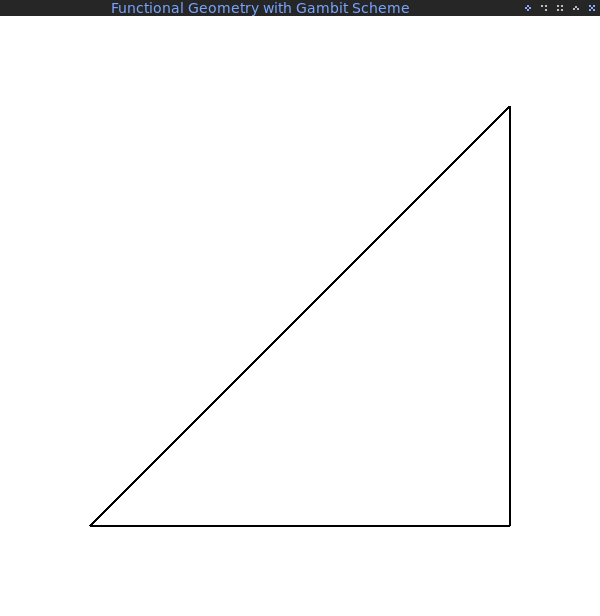
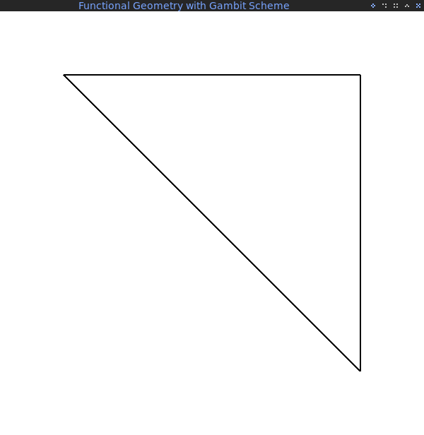
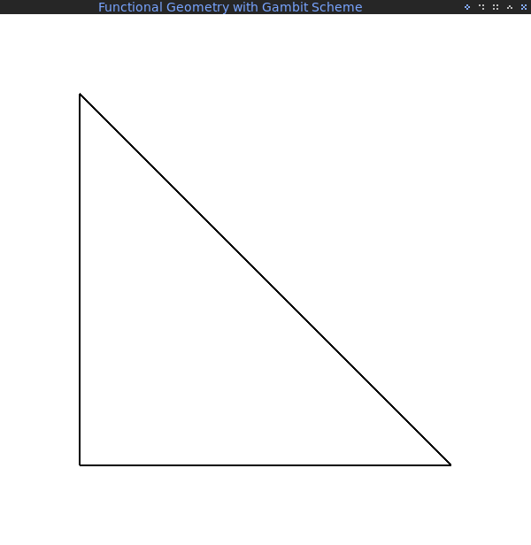
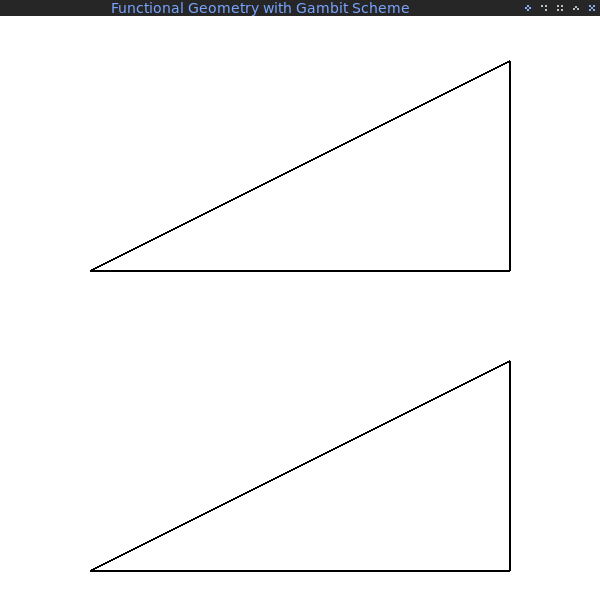
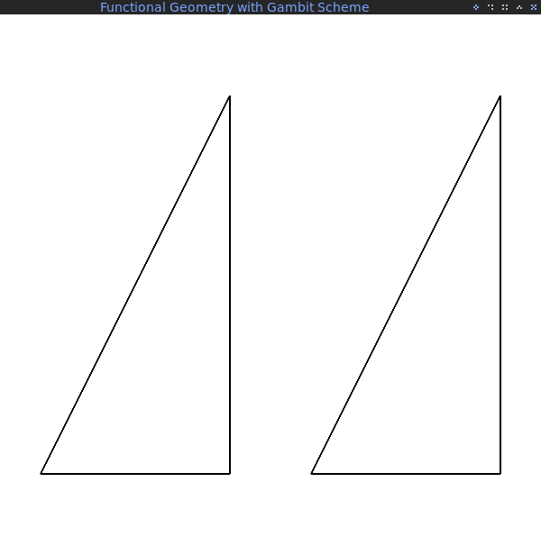
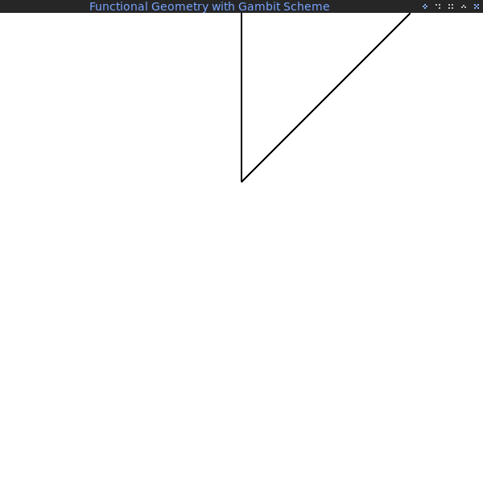
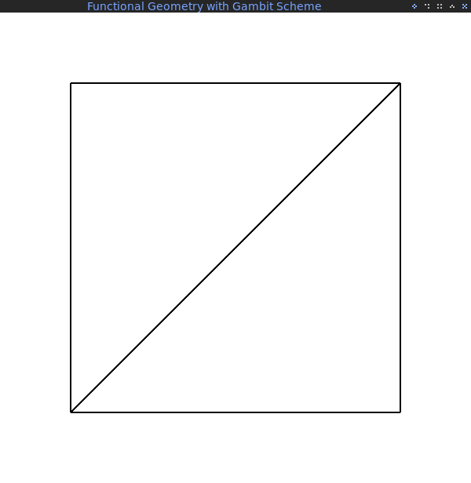
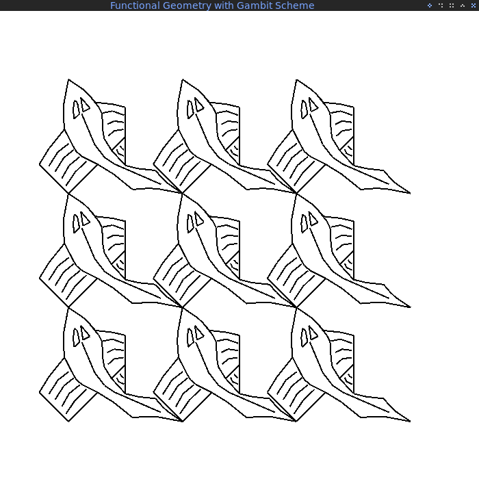
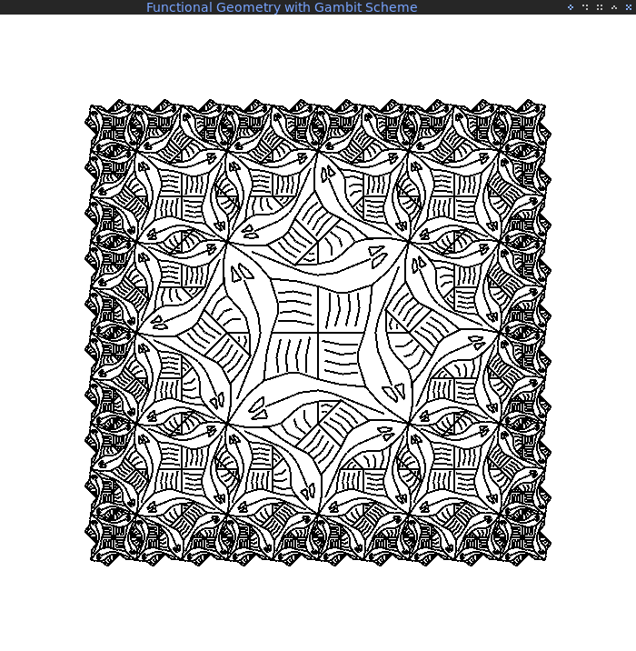

# Functional Geometry with Gambit Scheme and Raylib

This repository contains a simple implementation of a stratified picture language written in Scheme. It is heavily inspired by the papers [Functional Geometry][funcgeo] by Peter Henderson, and [Lisp: A Language for Stratified Design][lisp] by Harold Abelson and Gerald Jay Sussman. A more expansive discussion of these ideas can be found in [chapter 2.2.4 of SICP][sicp].

The code uses [raylib][1] to abstract away context creation and rendering onto a context to focus on the geometry language itself. [Gambit Scheme][2] is used as a compiler. Consider everything in this repository experimental *ready to break/explode at any moment*.

Consider this code to be "the busy work already done", so that you can experiment with the picture language at your leisure.

## Usage

This repository is purposefully kept very basic and simple. It is meant to be a starting point for your own experiments, not as some kind of "reference implementation".

### Building

This repository comes with raylib already integrated as a git submodule. This reflects my personal preferences, if you prefer to use CMake's `FetchPackage`, it should be easy enough to modify the main `CMakeLists.txt` to do that (I haven't tested it, tough).

It comes with a simply CMake-based language configuration for Gambit Scheme. These are the tools you need to use the code in this repository:

* [CMake][3]
* [make][4] (or any build system you prefer, like Ninja, etc.)
* [Gambit Scheme][2]
* Optional: [Raylib][1] (if you want to use a system-wide installation instead of the submodule provided here)

To start writing code, clone this repository and make sure all submodules are downloaded too:

```bash
git clone --recursive https://github.com/georgjz/functional-geometry-gambit-scheme.git functionalgeometry
```

To build the example code found in `src/main.scm`, just execute:

```bash
cd functionalgeometry
cmake -S . -B build
cmake --build build
./build/functional-geometry-fish
```

Building raylib for the first time may take a minute or two, but it only needs to be done once. If you wish to change the name of the output binary, just edit line 8 of `CMakeLists.txt`.

#### Warning About Gambit Scheme Naming

Because I'm using Arch Linux, there's a bit of a naming conflict when installing Gambit Scheme. So the Gambit compiler `gsc` is called `gambitc` on my system (this avoids a naming clash with GhostScript). To avoid this problem, there are three options:

1. If you already have Gambit Scheme compiler installed as `gsc` on your system, change all occurences of `gambitc` into `gsc` in all files in the `cmake` subdirectory.
2. If you build Gambit Scheme from source, use the `--enable-interpreter-name` and `--enable-compiler-name` options during the configuration step to rename `gsc` into `gambitc`.
3. `$ alias gambitc=gsc`

It's a bit annoying right now, but this will be fixed when I improve the CMake language definition.

## Comments on the Code Structure

This code tries to follow the ideas presented in [Lisp: A Language for Stratified Design][lisp]. For that purpose, I'm going to describe the layers used in this repository and my reasoning behind my design decisions. I do not claim that this is the best way to execute layered/stratified design, this is just my attempt at it with code written from scratch. The layers/strata are presented from buttom to top.

The ultimate goal is to provide a picture language based on simple procedures that operate under closure over pictures. That is, every procedure takes (a) picture(s), and returns a picture. This allows to you build complex pictures from a handful of simple manipulators and combinators, and lets you define your own easily.

### Stratum -1: `src/raylib.scm` and `src/vector.scm`

I name this stratum "-1" because these procedures aren't strictly part of the picture language in my understanding. The procedures in `src/raylib.scm` bind Scheme procedures to their raylib counterparts. For the most part, they take care of creating and destroying an OpenGL context with GLFW for the code to render onto. Some simple rendering procedures are bound too. Keep in mind that I only bind a very small handful of procedures found in [raylib][1], check the documentation for a full list. It may be useful to bind additional raylib prodecures for your own experiments.

`src/vector.scm` contains a few simple procedures for 2D vector arithmetics. I debated myself if this procedures should rather be in stratum 0, but I reasoned that procedures of one stratum should (ideally) rely exclusively on procedures provided by the stratum directly below it (as you'll see, I wasn't always able to adher to this rule). A proper list of (at least) two floating-point numbers is considered a vector in this code.

```Scheme
(define vec1 '(2.0 3.5))        ; valid vector
(define vec2 (list 6.1 3.33))   ; valid vector
(define vec3 '(4.5 . 7.6))      ; invalid vector, improper list
(define vec4 '(8.1 6.9 5.2))    ; while invalid in a logical sense, would still work with this code
```

I considered adding helper procedures for boxes, but decided against it for brevity. If you wish to add them, it's trivial to do:

```Scheme
(define offset (lambda (box) (car box)))
(define horiz (lambda (box) (cadr box)))
(define vert (lambda (box) (caddr box)))
```

### Stratum 0: `src/picture.scm`

This is the lowest stratum of the picture language. A picture is a function that takes a box as argument and transforms its list of vectors with the help of the procedure `mapper`. To create a picture, use the procedure `primitive-picture` which takes a list of vectors as argument.

### Stratum 1: `src/primitives.scm`

These procedures take one or more pictures as argument and return a transformed picture. A picture is worth a thousand words (see what I did there?):

```Scheme
;;; Define actual data to draw
(define triangle (primitive-picture '((0.85 0.15)
                                      (0.85 0.85)
                                      (0.15 0.85)
                                      (0.85 0.15))))

;;; Assume a rendering context with an origin at (0, 0) and a size of 600 by 600 pixels
(define base-box '((0.0 0.0)
                   (600.0 0.0)
                   (0.0 600.0)))
```

```Scheme
(triangle base-box)
```



```Scheme
((rot triangle) base-box)
```



```Scheme
((flip triangle) base-box)
```



```Scheme
((above triangle triangle) base-box)
```



```Scheme
((beside triangle triangle) base-box)
```



```Scheme
((rot45 triangle) base-box)
```



```Scheme
((over triangle
       (rot (rot triangle)))
       base-box)
```



**Caveat**: When reading the code in `src/primitives.scm` and comparing it to [Functional Geometry][funcgeo], keep in mind that in Peter Henderson's paper, the origin of the coordinate system is in the *lower left corner*, while most computer graphic libraries (including raylib) put the origin at the *upper left corner*. This results in slightly different implementations (i.e., some of the vectors are calculated differently). But the base idea of manipulating the vectors of a enclosing box to transform pictures remains the same.

### Stratum 2: `src/combinators.scm`

This is the real meat of the code. The procedures in this file are probably your best starting point for your own experiments. They all are built on top of the procedures bound in `src/primitives.scm` to build complexity step by step.

```Scheme
((nonet fish fish fish fish fish fish fish fish) base-box)
```



Read [Functional Geometry][funcgeo]. No, seriously.

### The Fish



Read. The. [Paper][funcgeo].

## Funny Things To Try

* Colors! Line thickess! Use your imagination
* Rewrite the primitives `beside`, `above`, and `over` as variadic functions (aka, pass as many images as you want; warning, this is not trivial! May need to rethink how to represent a shape)
* Add curves
* There's a lot of duplicate code in `src/primitives.scm`, lots of potential for abstraction/flex your functional muscle.
* *THE THIRD DIMENSION O_O*

## Known Bugs and Future Features

* In the build commands above, I explicitly tell CMake to use `gcc`; I have used both `gcc` and `clang` successfully to build all code in this repository. But since Gambit Scheme itself is built with `gcc`, I prefer to keep it consistent.
* **This code is not tested on Windows and OSX**. I have only tested this code as well as the CMake files on Arch Linux.
* I'd want to add some CEPL-like environment.

## Contribution

Contributions are highly encouraged and welcomed! I'll probably need some help by porting to Windows and OSX; my experience on developing on these platforms is very limited.

## License

Everything in this repository is released under the [MIT License][5] (see `LICENSE`). For the raylib license, [go here][6].

[1]: https://www.raylib.com/index.html
[2]: https://github.com/gambit/gambit
[3]: https://cmake.org
[4]: https://www.gnu.org/software/make/manual/html_node/index.html
[5]: https://opensource.org/licenses/MIT
[6]: https://github.com/raysan5/raylib/blob/master/LICENSE
[funcgeo]: https://eprints.soton.ac.uk/257577/1/funcgeo2.pdf
[lisp]: https://dspace.mit.edu/bitstream/handle/1721.1/6064/AIM-986.pdf
[sicp]: https://sarabander.github.io/sicp/html/2_002e2.xhtml#g_t2_002e2_002e4
